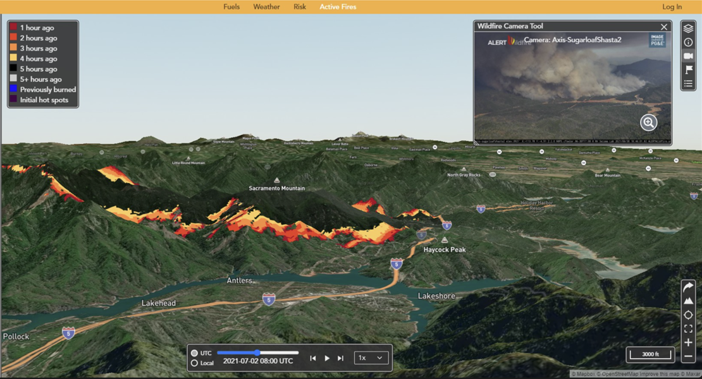

ELMFIRE- Eulerian Level Set Model of FIRE spread
================================================

ELMFIRE, the Eulerian Level set Model of FIRE spread, is open-source 
software Licensed under the `Eclipse Public License - 2.0 
<https://www.eclipse.org/legal/epl-2.0/>`_ (EPLv2). It is a
wildland fire spread model that can be used to:

* Forecast the spread of fires in real time.
* Reconstruct the spread of historical fires.
* Quantify landscape-scale fire behavior potential.
* Estimate annual burn probability and fire severity.

Getting started
===============

This section explains installation and configuration of ELMFIRE.

.. toctree::
   :maxdepth: 2

   getting_started

Tutorials
=========

The best way to learn to use ELMFIRE is to use ELMFIRE. To that end, a
series of tutorials is presented here, starting with very simple
idealized cases and progressing to complex simulations involving
real-world fuel and weather inputs.

.. toctree::
   tutorials

Verification
============

After completing the tutorials above, it is recommended to work through 
the verification test cases below.

.. toctree::
   verification

Validation
==========

ELMFIRE is packaged with a series of command line microservices clients 
that provide access to fire perimeter data that can be used for model 
validation. Some examples are presented below.

.. toctree::
   validation

User guide
==========

ELMFIRE's source code, build scripts/makefiles, documentation,
tutorials, and verification & validation (V+V) cases are in `ELMFIRE's
GitHub repository <https://github.com/lautenberger/elmfire>`_. Please
see the :ref:`Getting Started <getting_started>` page for instructions
on how to obtain the source code, install prerequisites, set necessary
environment variables, etc.

.. toctree::
   user_guide

Technical reference
===================

.. toctree::
   tech_ref
