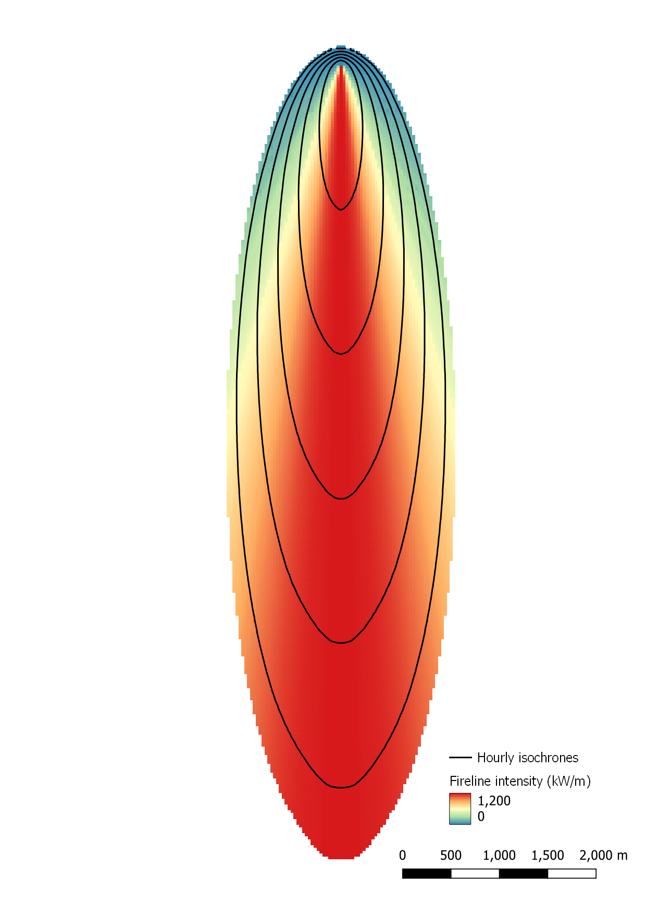

.. _tutorial_flat_terrain_constant_wind:

Tutorial 01:  fire spread in flat terrain under constant wind
-------------------------------------------------------------

One of the simplest wildland fire spread simulations, and the starting 
point for these tutorials, is a point ignition spreading in flat terrain 
under a spatially uniform and temporally invariant wind field. To run 
this simple model configuration, do the following:

.. code-block:: console

   cd $ELMFIRE_BASE_DIR/tutorials/01-constant-wind
   ./01-run.sh

Several output messages will scroll across the screen for a few seconds, 
and when the scrolling stops the run is complete. What just happened? 
Well, in short the BASH script ``01-run.sh`` created the geospatial 
inputs needed by ELMFIRE, ran ELMFIRE, and conducted basic 
post-processing on ELMFIRE's outputs. Let's examine this more closely by 
diving into the ``01-run.sh`` BASH script (i.e., ``pico 01-run.sh``).

The main inputs are specified between the commented lines ``# Begin 
specifying inputs`` and ``# End inputs specification``. The first three 
lines

.. code-block:: console

   CELLSIZE=30.0 # Grid size in meters
   DOMAINSIZE=12000.0 # Height and width of domain in meters
   SIMULATION_TSTOP=22200.0 # Simulation stop time (seconds)

are used to specify, respectively

 1. Cell (grid) size (m)
 2. Computational domain size (m)
 3. Simulation end time (s)

This will create a computational domain that is 12000.0 m / 30 m / pixel 
= 400 pixels by 400 lines. The simulation will terminate after 22,200 
seconds (6 hours 10 minutes).

ELMFIRE takes as input both 32 bit floating point (Float32) and 16 bit 
signed integer (Int16) rasters depending on the quantity being read in. 
For that reason, the ``01-run.sh`` script organizes inputs by data type, 
first Float32 and then Int16. The next group of lines specifies the 
values of seven Float32 inputs:

.. code-block:: console

 NUM_FLOAT_RASTERS=7
 FLOAT_RASTER[1]=ws   ; FLOAT_VAL[1]=15.0 # 20-ft wind speed, mph
 FLOAT_RASTER[2]=wd   ; FLOAT_VAL[2]=0.0  # 20-ft Wind direction, deg
 FLOAT_RASTER[3]=m1   ; FLOAT_VAL[3]=3.0  # 1-hr   dead moisture content, %
 FLOAT_RASTER[4]=m10  ; FLOAT_VAL[4]=4.0  # 10-hr  dead moisture content, %
 FLOAT_RASTER[5]=m100 ; FLOAT_VAL[5]=5.0  # 100-hr dead moisture content, %
 FLOAT_RASTER[6]=adj  ; FLOAT_VAL[6]=1.0  # Spread rate adjustment factor (-)
 FLOAT_RASTER[7]=phi  ; FLOAT_VAL[7]=1.0  # Initial value of phi field

The meaning of the first five inputs is self-explanatory; the final two 
inputs are ``adj`` - spread rate adjustment factor, and ``phi`` - the 
initial value of the level set function :math:`{\phi}`. Both of these 
should be left at 1.0.

The value of an input parameter can be modified by changing its 
corresponding ``FLOAT_VAL``. For example, setting ``FLOAT_VAL[1]=10.0`` 
would change 20-ft wind speed from 15 mph to 10 mph.

The next group of lines specifies Int16 inputs:

.. code-block:: console

 NUM_INT_RASTERS=8
 INT_RASTER[1]=slp     ; INT_VAL[1]=0   # Topographical slope (deg)
 INT_RASTER[2]=asp     ; INT_VAL[2]=0   # Topographical aspect (deg)
 INT_RASTER[3]=dem     ; INT_VAL[3]=0   # Elevation (m)
 INT_RASTER[4]=fbfm40  ; INT_VAL[4]=102 # Fire behavior fuel model code (-)
 INT_RASTER[5]=cc      ; INT_VAL[5]=0   # Canopy cover (percent)
 INT_RASTER[6]=ch      ; INT_VAL[6]=0   # Canopy height (10*meters)
 INT_RASTER[7]=cbh     ; INT_VAL[7]=0   # Canopy base height (10*meters)
 INT_RASTER[8]=cbd     ; INT_VAL[8]=0   # Canopy bulk density (100*kg/m3)

This group of inputs specifies values of the topography and fuel inputs 
needed by ELMFIRE. For consistency with units in GIS data obtained from 
`LANDFIRE <https://landfire.gov>`_, input values of canopy height and 
canopy base height have units of 10 :math:`\times` m, and input values 
of canopy bulk density have units of 100 :math:`\times` kg/m\ :sup:`3` \ 
.

The final three input lines

.. code-block:: console

 LH_MOISTURE_CONTENT=30.0 # Live herbaceous moisture content, percent
 LW_MOISTURE_CONTENT=60.0 # Live woody moisture content, percent
 A_SRS="EPSG: 32610" # Spatial reference system - UTM Zone 10

specify live herbaceous moisture content (in percent), live woody 
moisture content (also in percent), and the spatial reference system. 
For idealized cases such as the current tutorial, the latter isn't 
strictly necessary but is included here for consistency with later 
tutorials that use real-world geospatial inputs. data.

The lines in the ``01-run.sh`` script after ``# End inputs 
specification`` generally won't require modification. The first section 
after the inputs specification script uses `GDAL command line tools 
<https://gdal.org/programs/index.html>`_ to burn the user-specified 
input values into rasters with the ``CELLSIZE``, ``DOMAINSIZE``, and 
``A_SRS`` specified previously. These newly-created rasters will land in 
the ``./inputs`` directory that is created by the ``01-run.sh`` script. 
Note that the center point for these rasters is at coordinates 
``(0,0)`` and the corresponding lower left corner of the computational 
domain is ``(-DOMAINSIZE/2, -DOMAINSIZE/2)``.

Next, the file ``elmfire.data.in`` is copied to 
``./inputs/elmfire.data``, and values of various input parameters (e.g., 
``A_SRS``) are set accordingly. Then, ELMFIRE is run and outputs are 
created in the ``./outputs`` directory. These outputs include:

 1. Time of arrival (s):  ``time_of_arrival_XXXXXXX_YYYYYYY.tif``
 2. Spread rate (ft/min):  ``vs_XXXXXXX_YYYYYYY.tif``
 3. Fireline intensity (kW/m):  ``flin_XXXXXXX_YYYYYYY.tif``
 4. Hourly isochrones:  ``hourly_isochrones.shp``

In the above naming convention:

* ``XXXXXXX`` is the ensemble member number. In this tutorial there is a 
  single ensemble member so ``XXXXXXX`` = 0000001, but ELMFIRE can be run 
  in ensemble mode with thousands of ensemble members. In such cases, 
  this ID is necessary to provide separate outputs for each ensemble 
  member.

* ``YYYYYYY`` is the simulation time (s) at which the outputs were 
  written out. In this tutorial, the simulation is set up to write 
  outputs only at completion, i.e. when the simulation time exceeds the 
  user-specified ``SIMULATION_TSTOP``. Therefore, the value of 
  ``YYYYYYY`` will be 22,200 seconds or greater. In some instances it is 
  desirable to write outputs at a particular time interval, e.g. hourly, 
  in which case and multiple outputs corresponding to different 
  simulation times would be created for each ensemble member.

These outputs can be visualized with standard GIS software. We are 
particularly fond of `Quantum GIS (QGIS) <https://qgis.org/en/site/>`_, 
and will be using QGIS throughout for visualization purposes. The figure 
below shows a sample visualization of ELMFIRE outputs from this tutorial 
- fireline intensity with a spectral color ramp and hourly isochrones in 
front:

If you have been able to follow this tutorial and generate a simple map 
similar to that above, then congratulations, you are on your way to 
doing some really cool wildland fire modeling stuff!
