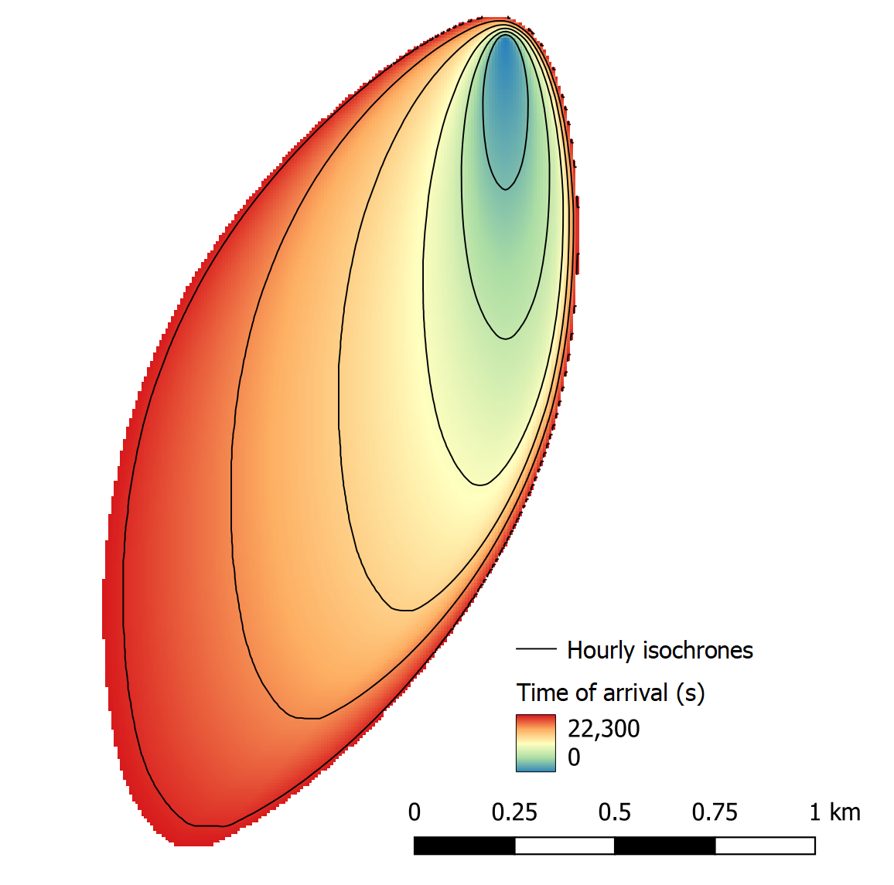

.. _tutorial_flat_terrain_with_wind:

Tutorial 02:  fire spread in flat terrain under transient wind
--------------------------------------------------------------

This tutorial builds on :ref:`Tutorial 01 
<tutorial_flat_terrain_constant_wind>` which showed how to set up and 
run a simple model of fire spread in flat terrain under a spatially 
uniform and temporally constant (North) wind field. In Tutorial 02, we 
introduce a time-dependent, but still spatially uniform, wind field.

As with Tutorial 01, to run Tutorial 02, do the following:

.. code-block:: console

   cd $ELMFIRE_BASE_DIR/tutorials/02-transient_wind
   ./01-run.sh

This will run a nominally 6-hr simulation with wind out of the north for 
the first 2 hours, shifting to the northeast between hour 2 and 4, and 
remaining out of the northeast for hours 4-6. The outputs, when 
visualized with a GIS package, should look similar to the image below 
which shows hourly isochrones overlaid on the time of arrival raster. 
Note that the fire first spreads due south for 2 hours before shifting 
to spread to the southwest, consistent with a wind out of the northeast:

What changes to Tutorial 01's input deck were required to model a 
transient wind field? ELMFIRE reads weather and fuel moisture inputs 
from rasters (usually GeoTiffs). In Tutorial 01, since the weather and 
fuel inputs were static, the input raters had a single band that applied 
for the duration of the simulation. In all but idealized test cases, 
weather and fuel moisture inputs will change in time so multiband 
(sometimes called "stacked") rasters are used to specify temporal 
variations. In Tutorial 02, the ``01-run.sh`` script parses the 
``wx.csv`` file and generates multiband GeoTiff rasters that are 
subsequently read in by ELMFIRE. Note that ELMFIRE does not directly 
read the ``wx.csv`` file but rather the rasters that are created by the 
``01-run.sh`` script according to the inputs specified in ``wx.csv``, 
shown below:

.. code-block:: console

   ws,wd,m1,m10,m100,lh,lw
   15,0,3,4,5,30,60
   15,0,3,4,5,30,60
   15,0,3,4,5,30,60
   15,22.5,3,4,5,30,60
   15,45,3,4,5,30,60
   15,45,3,4,5,30,60
   15,45,3,4,5,30,60

The header specifies that the column order is wind speed (ws), wind 
direction (wd), 1-hr dead fuel moisture (m1), 10-hr dead fuel moisture 
(m10), 100-hr dead fuel moisture (m100), live herbaceous fuel moisture 
(lh), and live woody fuel moisture (lw). Each row provides 
time-dependent values of each quantity. Here, the only quantity that 
varies in time is wind direction.

Since ``wx.csv`` contains no time column, how is time handled? When 
ELMFIRE reads in multiband rasters for temporally varying quantities, 
the timestep (:math:`{\Delta}` t ) between each band is constant and 
specified by the ``DT_METEOROLOGY`` keyword on the ``&INPUTS`` namelist 
group. Inspection of the ``inputs/elmfire.data`` file shows that 
``DT_METEOROLOGY = 3600.``, meaning that the time difference between 
bands is 3600 s or 1 hour. This is a typical meteorology timestep when 
working with gridded forecast data or historical reanalysis data.

Since multiband input rasters may contain more bands that are necessary 
for the simulation, the number of weather bands to use in the simulation 
is specified in the ``&MONTE_CARLO`` namelist group via the 
``NUM_METEOROLOGY_BANDS``. The ``inputs/elmfire.data`` file contains the 
following namelist group to specify that 8 bands from the weather / fuel 
moisture rasters will be used:

.. code-block:: console

   &MONTE_CARLO
   NUM_METEOROLOGY_TIMES = 8
   /

GDAL command line utilities can be used to quickly inspect the input 
rasters. After navigating to the inputs directory (``cd 
$ELMFIRE_BASE_DIR/tutorials/02-transient_wind/inputs`` the wind 
direction raster can be queried as follows:

.. code-block:: console

   $ gdallocationinfo -valonly wd.tif 1 1
   0
   0
   0
   22.5
   45
   45
   45
   45

This returns the expected result, namely that the wind direction raster 
contains 8 bands, with values in each band corresponding to the wd 
column specified in ``wx.csv``. The first row of data corresponds to a 
simulation time of 0 s, the second row to ``DT_METEOROLOGY`` s, the 
third row to 2 :math:`\times` ``DT_METEOROLOGY`` s, and so on. At run 
time, ELMFIRE uses linear interpolation to determine the value of 
time-dependent quantities at intermediate time steps since the numerical 
time step used during the fire spread simulation is typically much 
smaller than the timestep of the meteorological inputs.

Now is a good time to experiment with specifying various temporal 
variations in weather and fuel moisture fields and assessing the impact 
that these have on modeled fire behavior. This can be done by directly 
editing ``wx.csv`` and ``01-run.sh``. You may also want to change the 
ignition location, or specify multiple ignitions. This can be done by 
revising the ``&SIMULATOR`` namelist group in ``elmfire.data.in``:

.. code-block:: console

   &SIMULATOR
   NUM_IGNITIONS = 1
   X_IGN(1)      = 0.0
   Y_IGN(1)      = 3000.0
   T_IGN(1)      = 0.0
   /

Here, ``X_IGN`` and ``Y_IGN`` specify the x and y coordinates of the 
ignition, and ``T_IGN`` specifies the time of ignition. The index (1) 
specifies the ignition number. Multiple ignitions can be modeled by 
doing something similar to this:

.. code-block:: console

   &SIMULATOR
   NUM_IGNITIONS = 2
   X_IGN(1)      = X1
   Y_IGN(1)      = Y1
   T_IGN(1)      = T1
   X_IGN(2)      = X2
   Y_IGN(2)      = Y2
   T_IGN(2)      = T2
   /

where X1, Y1, T1 and X2, Y2, T2 specify the desired ignition locations 
and time of ignition.
