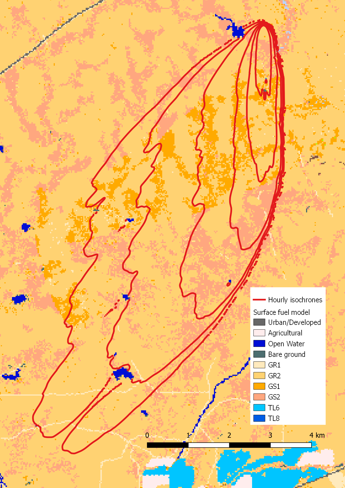

.. _tutorial_real_fuels_idealized_wind:

Tutorial 03:  fire spread in real-world fuel/terrain under constant/uniform wind
--------------------------------------------------------------------------------

Tutorial 03 is similar to :ref:`Tutorial 02 
<tutorial_flat_terrain_with_wind>` except we replace its idealized flat 
terrain and uniform/constant fuels with real-world fuels and topography. 
Transient wind and fuel moisture conditions remain the same as in Tutorial 02. 

To simplify the process of obtaining real-world fuel, topography, 
weather, and fire perimeter data, ELMFIRE uses a collection of command 
line tools - collectively known as Cloudfire - to obtain GIS data for 
fire modeling from the cloud. These microservices use `Google Remote 
Procedure Call <https://grpc.io>`_ (gRPC) and `GNU Wget 
<https://www.gnu.org/software/wget>`_ to pull GIS data from a Cloudfire 
server. If not already installed, it will be necessary to install wget 
and gRPC as follows:

.. code-block:: console

   sudo apt-get install wget
   sudo pip3 install grpcio grpcio-tools

Once these packages are installed, fuel data can be obtained from Cloudfire's 
fuel/weather/ignition client using commands of the form:

.. code-block:: console

   fuel_wx_ign.py \
   --do_wx=False --do_ignition=False \
   --center_lon=-120.281 --center_lat=37.440 \
   --fuel_source='landfire' --fuel_version='2.2.0' \
   --outdir='./fuel' --name='tutorial03'

This will create the directory ``fuel`` (or more generally, a directory 
name specified by the ``--outdir`` flag) that will contain a file named 
``tutorial03.tar``, as specified by the ``--name`` flag. This tarball 
contains fuel and topography rasters but no weather or ignition data as 
specified by the first three flags. 

The latitude and longitude of the center of the raster is specified by 
the command line arguments ``--center_lon`` and ``--center_lat`` as a 
location Northeast of Merced, CA (120.281 W, 37.440 N). The size of the 
raster defaults to 60 km by 60 km which is usually sufficient for fire 
modeling purposes. However, if a tile of a different size is desired, 
the flags ``--west_buffer``, ``--east_buffer``, ``--south_buffer``, and 
``--north_buffer`` can be used to specify the distance, in km, between 
the tile center and its respective west, east, south, and north edges.

To simplify running of Tutorial 03, the command in the code block above 
is added to the script 
$ELMFIRE_BASE_DIR/tutorials/03-real-fuels/01-run.sh. This script sets up 
and runs a point ignition (corresponding to ``--center_lon`` and 
``--center_lat`` identified above) under the same transient wind and 
fuel moisture conditions from :ref:`Tutorial 02 
<tutorial_flat_terrain_with_wind>`.

.. code-block:: console

   cd $ELMFIRE_BASE_DIR/tutorials/03-real-fuels
   ./01-run.sh

The Figure below shows modeled hourly isochrones 
(``outputs/hourly_isochrones.shp``) overlaid on satellite imagery (left) 
and surface fuel model (``inputs/fbfm40.tif``)) on the right. Note the 
similarities in the overall fire shape to :ref:`Tutorial 02 
<tutorial_flat_terrain_with_wind>`. Since the wind and fuel fields are 
the same in both tutorials, deviations from the idealized elliptical 
fire shape are due to differences primarily in fuels with a minor 
influence of topography. The shadowing effect of fuel breaks - in this 
case water bodies - is also apparent.

|tut03a| |tut03b|

.. |tut03a| image:: ../images/tutorial_03a.png
   :width: 45%

