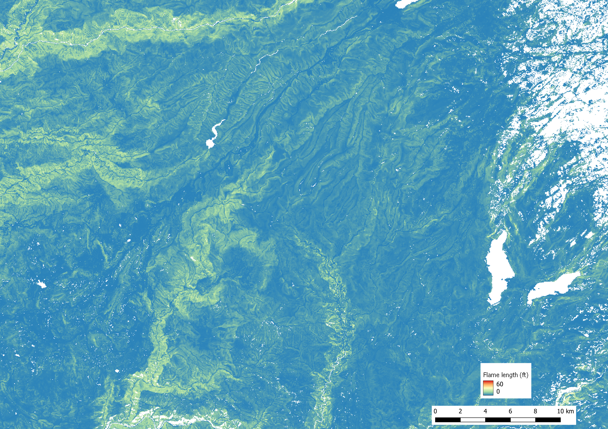

.. _tutorial_fire_potential:

Tutorial 04:  Landscape-scale fire potential
--------------------------------------------

Tutorials 01 - 03 involved modeling transient fire spread from a point 
ignition. ELMFIRE can also quantify landscape-scale fire 
potential (i.e., spread rate, flame length, etc.) assuming each pixel 
burns as a head fire in a manner similar to `FlamMap 
<https://www.fs.usda.gov/rmrs/tools/FlamMap>`_. In Tutorial 04, we 
assess how wind speed affects landscape-scale fire potential in part of 
California's Central Sierra that includes areas burned in the 2013 Rim 
Fire.

As in :ref:`Tutorial 03 <tutorial_real_fuels_idealized_wind>`, LANDFIRE 
2.2.0 fuel and topography inputs are are obtained from Cloudfire's 
fuel/weather/ignition microservice. These are used in combination with 
idealized spatially uniform wind speed/direction and fuel moisture 
meteorological inputs as specified in the ``wx.csv`` file:

.. code-block:: console

   ws,wd,m1,m10,m100,lh,lw
   0,0,2,3,4,30,60
   5,0,2,3,4,30,60
   10,0,2,3,4,30,60
   15,0,2,3,4,30,60
   20,0,2,3,4,30,60
   25,0,2,3,4,30,60

In :ref:`Tutorial 02 <tutorial_flat_terrain_with_wind>` and 
:ref:`Tutorial 03 <tutorial_real_fuels_idealized_wind>`, each row in 
``wx.csv`` corresponded to a different time. Here, each row can be 
thought of as specifying different combinations of spatially uniform 
wind and fuel moisture conditions to drive fire potential calculations. 
There are six different combinations of input parameters with all inputs 
held constant across combinations, with the exception of wind speed 
which is varied from 0 mph to 25 mph at 5 mph increments. Therefore, a 
total of six separate fire potential calculations will be conducted when 
Tutorial 04 is executed:

.. code-block:: console

   cd $ELMFIRE_BASE_DIR/tutorials/04-fire-potential
   ./01-run.sh

The ``01-run.sh`` script sets up and runs ELMFIRE, including creating 
multiband meteorological input rasters from the inputs specified in 
``wx.csv``. Recall that ELMFIRE does not directly read the ``wx.csv`` 
file - instead it reads the rasters that are created by ``01-run.sh``. 
Comparing ``input/elmfire.data`` from :ref:`Tutorial 03 
<tutorial_real_fuels_idealized_wind>` and Tutorial 04 shows some 
differences in the ``&SIMULATOR`` namelist group. :ref:`Tutorial 03 
<tutorial_real_fuels_idealized_wind>` had this`` &SIMULATOR`` namelist 
group:

.. code-block:: console

   &SIMULATOR
   NUM_IGNITIONS = 1
   X_IGN(1) = 740548.710
   Y_IGN(1) = 4147156.024
   T_IGN(1)      = 0.0
   /

which, in Tutorial 04, looks like this:

.. code-block:: console

   &SIMULATOR
   MODE = 2
   /

ELMFIRE has two primary modes of operation. The first, and default, is 
``MODE=1`` which directs ELMFIRE to run a transient simulation of fire 
spread across a landscape as in the first three tutorials. Setting 
``MODE=2`` as above directs ELMFIRE to burn every pixel on the landscape 
as a head fire similar to FlamMap.

Other differences between :ref:`Tutorial 03 
<tutorial_real_fuels_idealized_wind>` and 04 include elimination of the 
``&TIME_CONTROL`` namelist group (since time step, CFL number, and 
simulation stop time are not relevant) as well as modifications to the 
``&MONTE_CARLO`` namelist group which now reads:

.. code-block:: console

   &MONTE_CARLO
   METEOROLOGY_BAND_START                   = 1
   METEOROLOGY_BAND_STOP                    = 6
   METEOROLOGY_BAND_SKIP_INTERVAL           = 1
   /

This directs ELMFIRE to start in ``ws.tif``, ``wd.tif`` etc. with 
``METEOROLOGY_BAND_START`` (which in this case is 1) and conduct fire 
potential calculations. ELMFIRE will then increment the meteorology band 
by ``METEOROLOGY_BAND_SKIP_INTERVAL`` and conduct fire potential 
calculations for the next meteorology band. This continues until 
``METEOROLOGY_BAND_STOP`` is exceeded.

In this case, six separate fire potential calculations (corresponding to 
wind speed = 0, 5, 10, 15, 20, and 25 mph) are conducted. Outputs (flame 
length and spread rate) are written to the ``outputs`` folder with the 
meteorology band number appended to the quantity name before the 
``.tif`` suffix. For example, ``head_fire_flame_length_001.tif`` 
corresponds to the first meteorology band (wind speed = 0 mph), and 
``head_fire_flame_length_006.tif`` corresponds to the sixth meteorology 
band (wind speed = 25 mph).

A couple notes:

   1. Wind and slope are not assumed to be aligned, meaning wind 
   direction affects potential fire behavior. Running fire potential 
   calculations for the same landscape varying only wind direction will 
   give different results, with the highest spread rate and flame length 
   occurring when wind and slope are aligned, and the lowest occurring 
   when they are opposed.

   2. By default, modeled spread rate and flame length include the 
   effect of crown fire. Crown fire can be disabled by adding the 
   keyword ``CROWN_FIRE_MODEL = 0`` to the ``&SIMULATOR`` namelist 
   group. Currently, only one crown fire model is implemented and it is 
   disabled by setting ``CROWN_FIRE_MODEL = 0`` and enabled by setting 
   ``CROWN_FIRE_MODEL`` to any value greater than 0.

Potential flame length is shown below for the 0 mph (top image) and 25 
mph (bottom image) cases.

.. image:: ../images/tutorial_04b.png
   :scale: 30 %
   :alt: Tutorial 04 potential flame length - 25 mph wind
   :align: center
