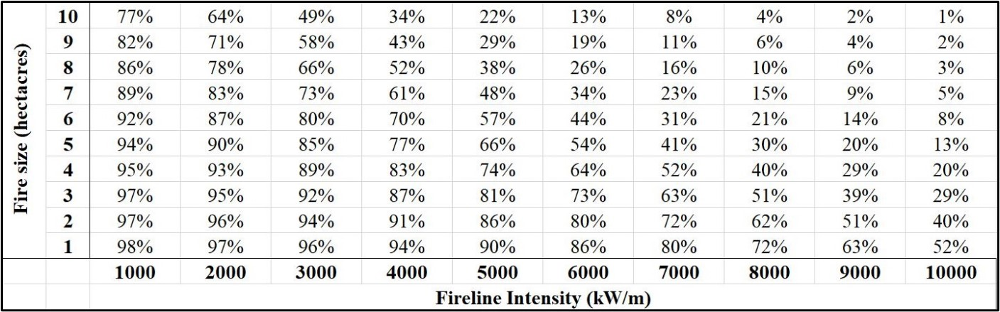

Suppression
===========

ELMFIRE includes experimental initial attack and extended attack 
suppression models. These models, both disabled by default, can be 
configured from the ``&SUPPRESSION`` namelist group.

.. ia:

Initial Attack
--------------

The approach used here to quantify initial attack probability of 
containment is based on the analysis of `Hirsch et al. 
<https://academic.oup.com/forestscience/article/44/4/539/4627517`_ who 
leveraged expert judgment to quantify initial attack effectiveness as a 
function of fire size and head fire fireline intensity, *i.e.* intensity 
at the main advancing fire front, at the time of initial attack 
commencement. The authors developed an expression for probability of 
containment (*POC*) as a function of fire size (*A*) and fireline 
intensity (*I*) which is given in the equation below:

.. math::

   POC = \frac{E}{1+E}
   ln E = 4.6835 - 0.7043A - 0.00041I - 0.000052AI

In the equation above, :math:`{A}` is in hectares and :math:`{I}` is in 
kW/m. Since trends in probability of containment are not immediately 
apparent upon inspection of the equation, probability of containment 
calculated from the equation is tabulated in the following table as a 
function of fire size and head fire fireline intensity at the time of 
initial attack. Although the qualitative trends in the table are 
logical, *i.e.* containment probability increases with smaller fires, 
lower intensity, or both, the `Hirsch et al. 
<https://academic.oup.com/forestscience/article/44/4/539/4627517`_ study 
was based on expert opinion from Canadian firefighters so differences in 
suppression tactics between Canadian and U.S. agencies are not reflected 
in the table.

In order to use the equation, the time of initial attack commencement 
relative to the time of fire ignition (:math:`{t_{ign}}`) must be 
established for each ignition location. This can be viewed as the sum of 
fire detection time (:math:`{t_d}`), report time (:math:`{t_r}`), and 
travel time (:math:`{t_t}`):

.. math::

   t_{initial attack} - t_{ign} = t_d + t_r + t_t

Initial attack suppression modeling, disabled by default, can be enabled 
by setting ``ENABLE_INITIAL_ATTACK=.TRUE.``. The time of initial attack 
commencement, in seconds, must also be specified using the 
``INITIAL_ATTACK_TIME`` keyword.
 
.. exta:

Extended Attack
---------------

Change in containment (:math:`{\Delta C}`) during time interval 
:math:`{\Delta t}` (in days) is:

.. math::

   \frac{\Delta C}{\Delta t} \approx \chi (1 - \frac{logA_d}{logA_{d0}})f(SDI_{\Delta t})

where :math:`{Chi}` is suppression effectiveness coefficient (-), 
:math:`{A_d}` is areal growth on a daily basis (acres/day), and 
:math:`{A_{d0}}` is areal growth on a daily basis at which containment 
change becomes negative (acres/day).

The function :math:`{f(SDI_{\Delta t})}` is calculated from the mean 
suppression difficulty index during interval :math:`{\Delta t 
(\bar{SDI_{\Delta t}})}` as:

.. math::

   \begin{equation}
   f(SDI_{\Delta t}) = 
   \begin{cases}
      \exp(-B \bar{SDI_{\Delta t}}), & \text{for}\ \frac{\Delta C}{\Delta t}\geq0 0
      \exp(B \bar{SDI_{\Delta t}}), & \text{for}\ \frac{\Delta C}{\Delta t} < 0
   \end{cases}
   \end{equation}

where :math:`{B}` is the calibration constant, :math:`{i}` is the pixel 
index, :math:`{n}` is the number of pixels during time interval 
:math:`{\Delta t}`, and :math:`{SDI_i}` is the Suppression Difficulty 
Index of pixel i.

The extended attack model can ben enabled by setting 
``ENABLE_EXTENDED_ATTACK=.TRUE.``. Additional parameters that can be 
used to fine tune the extended attack model are:

.. code-block::

   B_SDI                      = 1.0
   DT_EXTENDED_ATTACK         = 3600.
   AREA_NO_CONTAINMENT_CHANGE = 10000.0
   MAX_CONTAINMENT_PER_DAY    = 100.0
   SDI_FACTOR                 = 1.0
   USE_SDI                    = .FALSE.
   USE_SDI_LOG_FUNCTION       = .FALSE.
