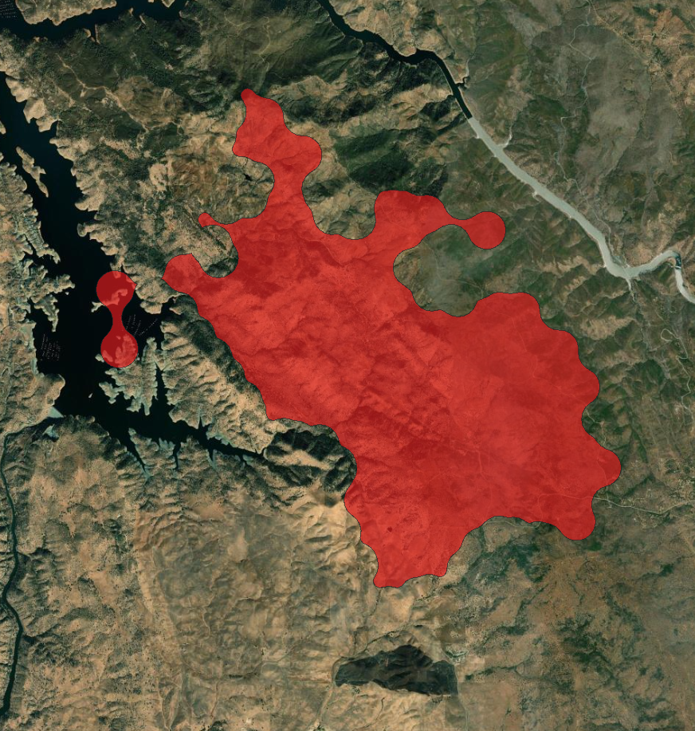

.. _validation:

Validation
==========

ASTM E1355 *Standard Guide for Evaluating the Predictive Capability of 
Deterministic Fire Models* (2018) defines *model validation* as "the 
process of determining the degree to which a calculation method is an 
accurate representation of the real-world from the perspective of the 
intended uses of the calculation method." 

Model validation ("How closely do model calculations represent reality") 
is assessed by comparing modeled fire perimeters to observed fire 
perimeters. This is done with ELMFIRE in both real-time forecasting mode 
as well as for retrospective analyses where historical fires are 
modeled. ELMFIRE has been used for real-time forecasting of wildland 
fire spread for most large fires in the Continental US from 2020 -- 
current. Fire spread forecasts are available on the "Active Fires" tab 
of `Pyrecast <https://pyrecast.org>`_, allowing predictive skill to be 
assessed in real-time by overlaying satellite hotspot and infrared fire 
perimeter data.

In addition to its use in `Pyrecast <https://pyrecast.org>`_, ELMFIRE is 
one of three fire spread models used in the Federal Risk Management 
Assistance (RMA) `Fires Comparison Dashboard 
<https://experience.arcgis.com/experience/f9d7f7f920494c3db43a23a8dffe4664/page/Fires-Comparison/>`_ 
for prioritizing resource allocation at the federal level. A 
retrospective assessment of 214 separate 7-day ELMFIRE forecasts made 
during the 2022 fire season was conducted. The results of this 
assessment are summarized in Table 1. The majority of forecasts were 
acceptable or better, with a small percentage of forests rated as poor 
or fair. This performance was found to be comparable to other models 
used in the RMA Fires Comparison Dashboard.

.. csv-table:: ELMFIRE Qualitative Forecast Skill for 214 Forecasts Issued During 2022.
   :align: center
   :file: tables/2022.csv
   :widths: 40, 40
   :header-rows: 1

An important caveat is that ELMFIRE's forecast skill is much better for 
wind-driven fires than for plume-dominated fires \[1\]. This is a 
feature common to all wildfire spread models that are not coupled to the 
atmosphere.

To provide users with a means to independently conduct model validation 
exercises, ELMFIRE is packaged with a series of command line 
microservices clients that can be used to obtain historical fire 
perimeter data. The two main tools are:

* ``$ELMFIRE_BASE_DIR/cloudfire/available_polygons.py``: List available 
  fire perimeter polygons
* ``$ELMFIRE_BASE_DIR/cloudfire/get_polygons.py``: Download a specific 
  fire perimeter polygon

A brief explanation of how these tools are used is shown below, with 
additional details presented in the :ref:`User Guide<user_guide>`.

The first step is to query which fires are available using 
``available_polygons.py``. Assuming the directory 
``$ELMFIRE_BASE_DIR/cloudfire`` is in the current user's ``$PATH``, the 
command to obtain a list of active (meaning ongoing) fires is:

.. code-block:: bash

   $ available_polygons.py --list 'fires' --active=True
   fl-hungryland
   fl-pine-wood
   ky-cane-fork

In this case, fire perimeter data from three active fires is available 
- two in Florida (Hungryland, Pine Wood) and one in Kentucky (Cane 
Fork). Fires for which historical fire perimeter data can be obtained by 
setting the flag ``--active=False`` and then specifying the desired year 
with the ``--year`` flag. For example:

.. code-block:: bash

   $ available_polygons.py --list 'fires' --active=False --year=2017
   az-brooklyn
   az-frye
   az-goodwin
   az-hilltop
   ca-atlas
   ca-detwiler
   ...

In this example a list of 60 fires for which perimeter data are 
available is written to stdout, but the list of available fires was 
truncated at the first six (sorted alphabetically). Available timestamps 
can be obtained by specifying the ``--firename`` argument to correspond 
to one of the available fire names along with ``--list='timestamps'``. 
For example:

.. code-block:: bash

   $ available_polygons.py --list 'timestamps' --active=False --year=2017 --firename='ca-detwiler'
   20170717_050800
   20170717_065000
   20170717_092500
   20170717_094100
   20170717_184600
   20170717_202600
   ...

Here, only the first six available timestamps are shown. Timestamps' 
timezone is UTC, meaning 20170717_050800 is July 17, 2017 at 05:08:00 
UTC (or July 16, 2017 at 10:08 PDT).

The above example shows how a list of available fires and timestamps can 
be obtained using ``available_polygons.py``. The next step is to 
obtain a local copy of the GIS data associated with a particular fire 
perimeter and timestamp. This is done using the ``./get_polygon.py`` 
microservice client. In the following example, we call 
``get_polgon.py`` requesting a specific polygon from the 2017 
Detwiler fire, and list the contents of the ``./out`` directory where we have specified the outputs should land:

.. code-block:: bash

   $ get_polygon.py --firename='ca-detwiler' --timestamp='20170717_202600' --outdir='./out' >& /dev/null
   $ ls -1 ./out/
   ca-detwiler_20170717_202600.dbf
   ca-detwiler_20170717_202600.prj
   ca-detwiler_20170717_202600.shp
   ca-detwiler_20170717_202600.shx

The left panel of the Figure below shows the shapefile above as 
visualized in QGIS. The larger circles are from cumulative MODIS 
detections, while the smaller circles are from cumulative VIIRS 
detections. Due to the "swiss cheese" nature of fire perimeters when 
built from satellite hot spot data (left panel), GIS operations such as a 
convex hull or sequential dilation / contraction can be used to build 
more consolidated perimeters. As an example, the fire perimeter in the 
right panel of the Figure below was generated by buffering the left 
panel by 500 m and then buffering that result by -500 m.

|detwiler1| |detwiler2|

Validation Cases
----------------

The following validation cases are presented to demonstrate how 
``available_polygons.py`` and ``get_polygon.py`` can be used 
along with ``fuel_wx_ign.py`` to build test cases for individual 
fires.

.. toctree::
   :maxdepth: 2

   validation/validation_01
   validation/validation_02

References
----------

\[1\] Stephens, S.L., Bernal, A.A., Collins, B.M., Finney, M.A.,
Lautenberger, C., and Saah, D., "Mass fire behavior created by extensive
tree mortality and high tree density not predicted by operational fire
behavior models in the southern Sierra Nevada," *Forest Ecology and
Management* **518**: 120258 (2022).

