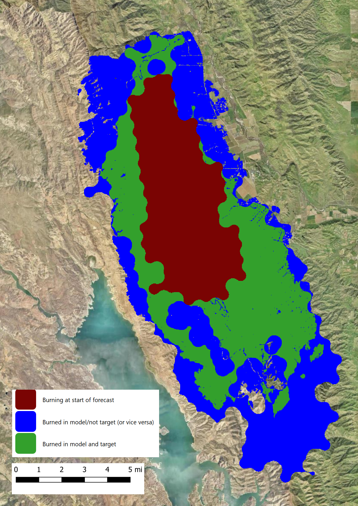

.. _validation_01:

Validation Case 01:  Single Fire
--------------------------------

This validation case demonstrates how to run a hindcast of a single fire 
with ELMFIRE and compare modeled fire perimeters to observed fire 
perimeters. California's 2018 County Fire, which burned in Yolo and Napa 
Counties in June 2018, is used as a template. Additional fires can be 
simulated by modifying this template, and an example of how to do this 
is provided at the end of this validation case.

The single-fire validation case (2018 County Fire) can be viewed as follows:

.. code-block:: bash

   $ cd $ELMFIRE_BASE_DIR/validation/01-single-fire
   $ pico 01-ca-county.sh

This test case contains the following lines (truncated at the end of the 
inputs specification section):

.. code-block:: bash

   #!/bin/bash

   # Specify inputs below:

   YEAR=2018
   FIRENAME=ca-county
   ACTIVE_FIRE_TIMESTAMP_NUM=1
   ALREADY_BURNED_TIMESTAMP_NUM=null
   WEST_BUFFER=30
   SOUTH_BUFFER=30
   EAST_BUFFER=30
   NORTH_BUFFER=30
   NUM_ENSEMBLE_MEMBERS=100
   RUN_HOURS=48
   FUEL_SOURCE=landfire
   FUEL_VERSION=1.4.0
   RUN_TEMPLATE=hindcast

   export USE_SLURM=no
   export CALC_FITNESS=yes

   # No need to modify from here down:
   ...

An explanation of the inputs specification part of this script is lines 
is:

* ``YEAR=2018`` and ``FIRENAME=ca-county``: The script 
  ``get_polygons.py`` needs the year and fire name to retrieve fire 
  perimeter GIS data.

* ``ACTIVE_FIRE_TIMESTAMP_NUM`` and ``ALREADY_BURNED_TIMETAMP_NUM``: 
  Rather than explicitly specifying fire perimeter timestamps to use in 
  fire initialization, the timestamp number (of sequentially sorted 
  available timestamps) is used to initialize the actively burning fire 
  perimeter (``ACTIVE_FIRE_TIMESTAMP_NUM``) and the already burned / 
  black area (``ALREADY_BURNED_TIMESTAMP_NUM``). The latter can be set 
  to ``null`` as in this case if the entire fireline is active.

* ``WEST_BUFFER``, ``SOUTH_BUFFER``, ``EAST_BUFFER``, ``NORTH_BUFFER``: 
  This is the size of the buffer, in units of km, that is added around 
  the active fire polygon. The buffer should be large enough to prevent 
  spreading fires from hitting the edge of the computational tile. 
  Therefore, smaller buffers can be used for short-duration hindcasts or 
  fires burning under moderate weather conditions than for long-duration 
  hindcasts or rapidly spreading fires.

* ``NUM_ENSEMBLE_MEMBERS``: For this particular validation case, ELMFIRE 
  is run in ensemble mode where specific inputs are perturbed from their 
  baseline values to address model uncertainty (see the User Guide for 
  details on how ensembles are constructed). By default the ensemble 
  consists of 100 members, but this can be increased or decreased as 
  desired.

* ``RUN_HOURS``: The simulation run time defaults to 48-hours but longer 
  or shorter runs can be used.

* ``FUEL_SOURCE`` and ``FUEL_VERSION``: The script 
  ``fuel_wx_ign.py`` needs to know which fuel source (here, LANDFIRE) 
  and version (here, 1.4.0) should be used for creating fuel and 
  topography inputs. Currently, all major LANDFIRE releases (1.4.0, 2.2.0, 
  etc.) are available and the user should select a version that is 
  appropriate for the era of the fire being simulated. Details can be 
  found at the `LANDFIRE Schedule / Versions 
  <https://landfire.gov/lf_schedule.php>`_ page.

* ``RUN_TEMPLATE``: Different run templates can be used to setup 
  different base runs. Specifically, ``RUN_TEMPLATE`` specifies a 
  subdirectory off of ``$ELMFIRE_BASE_DIR/runs/hindcasts/templates`` 
  that contains customized run scripts and the ``elmfire.data`` 
  configuration file.

* ``export USE_SLURM=no``: ELMFIRE is run on several clusters that use 
  the `Slurm Workload Manager 
  <https://slurm.schedmd.com/documentation.html>`_ for job queueing and 
  prioritization. With ``USE_SLURM=no``, ELMFIRE will run locally. 
  However, if ELMFIRE is being run on a cluster where Slurm is used for 
  job management, setting ``USE_SLURM=yes`` will allow ELMFIRE to run on 
  remote nodes.

* ``export CALC_FITNESS=yes``: By default, a fitness metric that 
  quantifies how well modeled fire perimeters match observed perimeters 
  will be calculated for each ensemble member. This causes a large 
  number of intermediate files to be generated and adds considerably to 
  the required postprocessing time. Setting ``export CALC_FITNESS=no`` 
  can be useful for initial testing/debugging to cut down on cycle time.

After executing the run script (``./01-ca-county-sh``), inputs are 
created, ELMFIRE is executed, and post-processing is conducted. If the 
run is successful the directory ``ca-county_20180701_062200`` containing 
model inputs and outputs is created. Some of the more important files in 
this directory include:

* ``fuel`` and ``wx`` directories:  These folders contain the fuel/topo 
  and weather inputs that were generated by ``fuel_wx_ign.py``.

* ``elmfire.out``:  ELMFIRE's log file written to disk at run time. If 
  outputs are missing, this file can be useful for diagnosing what went 
  wrong.

* ``toa`` directory: Time of arrival (in seconds) rasters for each 
  ensemble member. Naming convention is 
  ``time_of_arrival_XXXXXX_YYYYYYY.tif`` where XXXXXX is the ensemble 
  member number and YYYYYYY is the simulation end time in seconds since 
  only a single time of arrival raster is dumped for each ensemble 
  member.

* ``targ`` directory:  This directory contains "target" fire perimeter 
  rasters against which modeled fire perimeters are compared when 
  calculating goodness of fit. Naming convention is 
  ``target_SECONDS.tif`` where SECONDS is the number of elapsed seconds 
  from the simulation start time.

* ``model`` directory: This directory contains modeled fire perimeter 
  rasters for each ensemble member at each of the times for which target 
  fire perimeter data are available. These are used for calculating the 
  correlation between modeled and observed perimeters (next bullet).

* ``corr`` directory:  Correlation rasters. Naming convention is 
  similar to the time of arrival rasers, except the time field in the 
  filename corresponds to a target time. For example, 
  ``corr_0000031_44220.tif`` is the correlation raster for ensemble 
  member 31 at 44,220 seconds after ignition. Pixels are coded as 0 (not 
  burned in target, not burned in model), +1 (burned in model and burned 
  in target), or -1 (burned in model and not burned in target or `vice 
  versa`).

* ``fire_size_stats.csv`: Summary statistics / diagnostics such as 
  modeled fire area, run time, etc. for each ensemble member.

* ``coeffs.csv``: Companion file to ``fire_size_stats.csv``. Provides 
  values of adjustable model coefficients for each ensemble member. The 
  rightmost column is an overall fitness metric that was calculated by 
  summing over the correlation rasters as described above. This file is 
  particularly useful for model calibration where an optimization 
  algorithm or machine learning is used to to improve agreement between 
  modeled and observed perimeters. Additional details can be found in 
  the Monte Carlo Simulation section of the User's Guide.

The Figure below shows one of the correlation rasters from a single 
ensemble member. The ELMFIRE simulation was initialized with the red 
area. The blue and green area show the correlation between modeled and 
observed fire perimeter after 36 hours of spread (from the red area). 
Green areas were burned in both the modeled and observed perimeter, and 
blue areas were burned in one but not the other.

Additional fires can be modeled by editing a few lines in the 
``01-single-fire.sh`` run script. This typically involves running 
queries with ``get_polygons.py`` to find available fires and perimeters, 
setting the ``YEAR`` and ``FIRENAME`` inputs accordingly, and adjusting 
other inputs as desired. 
