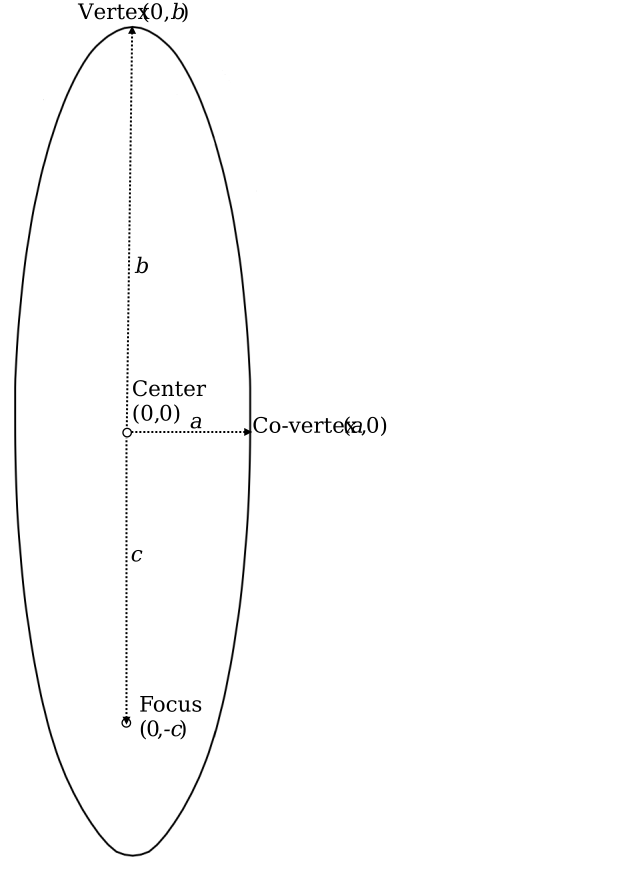
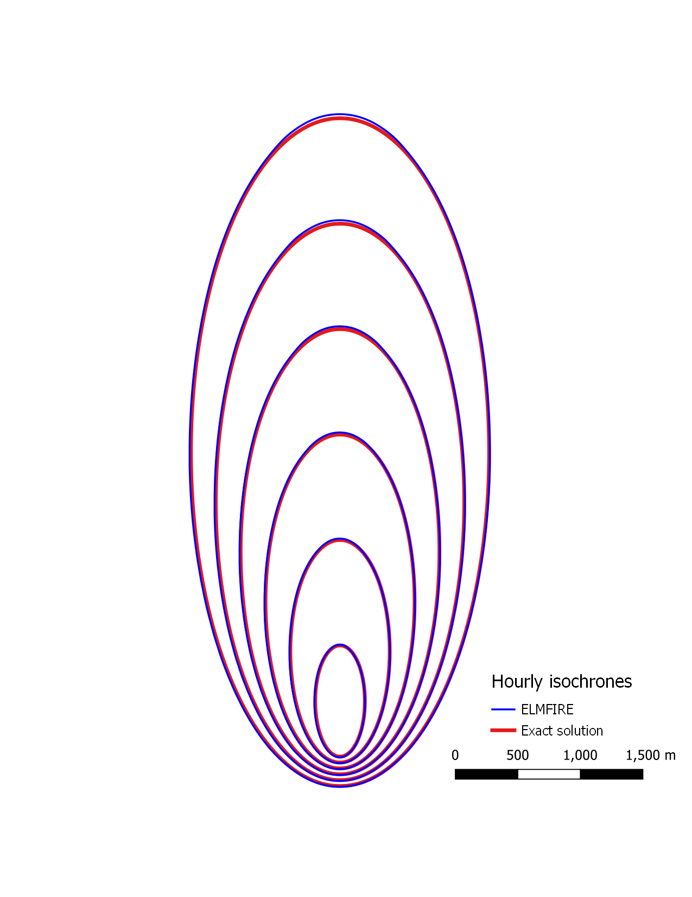

.. _verification_fire_shape:

Verification Case 01:  Elliptical fire shape
--------------------------------------------

Consider an ellipse centered at (0,0) with its minor axis oriented in
the *x* direction and its major axis oriented in the *y* direction. Some
relevant geometrical nomenclature and coordinates include:

-  Center: (0,0)

-  Vertices: (0,\ *b*) and (0,-*b*)

-  Co-vertices: (*a*,0) and (-*a*,0)

-  Foci: (0,\ *c*) and (0,-*c*)

With these definitions, the area of the ellipse is:

.. math::

   A = \pi ab

For a point source ignition and the simplified case of fire spreading in 
the +\ *y* direction at constant rate :math:`V_{head}`, the ellipse 
focus located at (0,-*c*) corresponds to the ignition point. Defining
:math:`V_{head}` as spread rate in the +\ *y* direction at (0,\ *b*), 
:math:`V_{flank}` becomes spread rate in the +\ *x* direction at (*a*, 
0), and :math:`V_{back}` is the spread rate in the -*y* direction at (0, 
-*b*). Assuming a constant rate of spread, the relationship between 
these spread rates, time *t*, and the elliptical dimensions *a*, *b*, 
and *c* are:

.. math::

   V_{head} × t = b + c

   V_{flank} × t = a

   V_{back} × t = b – c

From the above equation, the ratio of :math:`V_{head}` to 
:math:`V_{back}` is (*b* + *c*) / (*b* – *c*) which, from the 
geometrical properties of an ellipse, is related to its length-to-width 
ratio (*L*/*W*) as:

.. math::

   \frac{V_{\text{head}}}{V_{\text{back}}} = \frac{b + c}{b - c} = \frac{\frac{L}{W} + \sqrt{\left( \frac{L}{W} \right)^{2} - 1}}{\frac{L}{W} - \sqrt{\left( \frac{L}{W} \right)^{2} - 1}}

With :math:`V_{head}` and *L*/*W* known (more on this later),
:math:`V_{back}` can be calculated from the equation above. :math:`V_{flank}`
is then calculated as:

.. math::

   V_{\text{flank}} = \frac{1}{2}\frac{V_{\text{head}} + V_{\text{back}}}{L/W\ }

The ellipse length to width ratio (*L/W*) is usually estimated from empirical 
observations. Following Anderson (1983), ensuring that *L*/*W* = 1 at zero 
wind speed, and limiting the length to width ratio to 8, *L*/*W* can be 
estimated from mid-flame wind speed (:math:`U_{mf}`) in mph as:

.. math::

   \frac{L}{W} = \min\left\lbrack 0.936 \times \exp\left( 0.2566U_{\text{mf}} \right) + 0.461 \times \exp\left( - 0.1548U_{\text{mf}} \right) - 0.397,\ 8\  \right\rbrack

The equations above can be used to generate an exact solution for the position 
of the ellipses surface as a function of time. Assuming that the ignition 
location has coordinates (0, :math:`y_{ign}`) the procedure is as follows:

   1. Given :math:`V_{head}` and *L*/*W*, calculate :math:`V_{back}` and 
      :math:`V_{flank}` using the equations above.

   2. For a given time *t*: Calculate *a* = :math:`V_{flank}` × *t*, *b* = *a* 
      × *L/W*, and *c* = :math:`V_{head}` × *t* - *b*.

   3. The center of the ellipse at time t has coordinates (0, :math:`y_{cen}`) 
      where :math:`y_{cen}` = :math:`y_{ign}` + *c*.

   4. Given a value of *y* (such that :math:`y_{cen}` - *b* <= *y* <= 
      :math:`y_{cen}` + *b*): Values of *x* corresponding to the ellipse 
      surface are :math:`x = a × \sqrt{1 - ((y-y_{cen})/b)^2}`.

To generate exact solutions for ellipse surfaces that can be compared 
with ELMFIRE's modeled fire perimeters, we first need to establish 
values of :math:`V_{head}` and *L*/*W*. In ELMFIRE, :math:`V_{head}` is 
calculated from the Rothermel model and *L*/*W* is calculated from 
mid-flame wind speed using the above equation. Therefore, we use 
`BehavePlus 6.0.0 Beta 3 
<https://www.frames.gov/behaveplus/software-manuals>`_ to determine 
Vhead. Inputs to Behave's surface module are as follows:

* Fuel Model: GR2 (102)
* 1-h fuel moisture: 3%
* Live herbaceous fuel moisture: 30%
* 20-ft wind speed:  10 mph
* Slope steepness: 0%

Corresponding outputs are:

* Surface fire rate of spread:  46.15 ft/min
* Midflame wind speed:  3.62 mph

Plugging :math:`U_{mf}` = 3.62 mph into Equation 4 gives *L*/*W* = 2.236. 

To generate the exact solution perimeters corresponding to the preceding 
inputs and run the corresponding ELMFIRE validation case do the following:

.. code-block:: console

   cd $ELMFIRE_BASE_DIR/verification/01-elliptical-shape
   ./01-build-ellipse.sh

This will first generate GIS data for the exact solution ellipses using the 
above procedures. In the ``./exact_ellipses`` directory you will find six 
shapefiles, each corresponding to the ellipse position from 1 hour to 6 hours 
at an hourly interval. This script next runs the analogous ELMFIRE simulation 
by executing the ``./03-run-elmfire.sh`` script which takes approximately 60 
seconds.
 
Plotting exact solution ellipses from the ``exact_ellipses`` folder against 
ELMFIRE's ``./outputs/hourly_isochrones.shp`` file (see Figure below) shows 
that the numerical (ELMFIRE) and exact solution match to a precision better 
than 0.5%. This is typical in wildfire modeling - error and uncertainty 
introduced by underlying numerical methods, providing they are robust and 
correctly implemented, are small in comparison to other sources of error and 
uncertainty such as fuel and weather inputs.

Although the main purpose of this verification case is to assess how well the 
underlying Eulerian Level Set Method as implemented in ELMFIRE is capable of 
generating idealized elliptical fire shapes, it also preliminarily 
demonstrates two additional aspects of model verification:

   1. The Rothermel model, which provides the head fire spread rate as a 
      function of fuel model, fuel moisture, wind speed, and slope is 
      correctly implemented in ELMFIRE.

   2. Since ELMFIRE was provided with only a 20-ft wind speed but the 
      Rothermel model operates on midflame wind speed, the wind 
      adjustment factor that converts 20-ft wind speed to mid-flame wind 
      speed is correctly implemented in ELMFIRE.

Since the above statements are limited to the combinations of inputs used in 
this verification exercise, these important aspects of model verification are 
explored in greater detail later.
