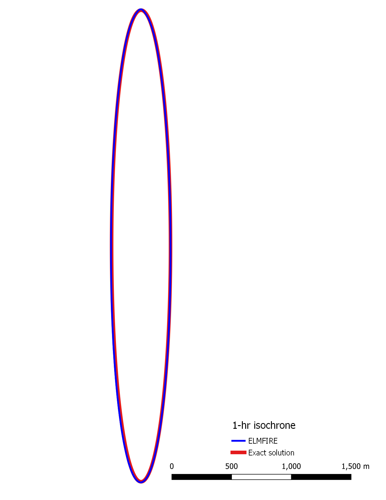

.. _verification_crown_fire:

Verification Case 02:  Crown Fire
---------------------------------

Torching occurs when a surface fire ignites ladder fuels or the canopy 
base, in turn carrying fire to the upper parts of the tree canopy. 
Physically, torching does not occur if flames from surface fuels are not 
sufficiently intense to ignite ladder fuels and/or the canopy base. 
Therefore, simple physical arguments suggest that crown fire initiation 
is a function of canopy base height, fuel moisture content (since it 
affects ignitability), and a measure of surface fire intensity such as 
flame length or fireline intensity (heat release rate per unit length of 
fireline).

The most widely used correlation for crown fire initiation is a go/no-go 
test based on fireline intensity. Crown fire occurs only when fireline 
intensity exceeds a critical value 
(:math:`{\dot{Q}}_{\text{crit}}^{'}`), otherwise, surface fire occurs.
:math:`{\dot{Q}}_{\text{crit}}^{'}` for torching is estimated as [Van Wagner 1977]:

.. math::

   {\dot{Q}}_{\text{crit}}^{'} = \left( 0.01\text{CBH}\left( 460 + 26M_{\text{fol}} \right) \right)^{3/2}

Where CBH is canopy base height (m) and :math:`M_{fol}` is foliar 
moisture content (%). If fireline intensity of the surface fire exceeds 
:math:`{\dot{Q}}_{\text{crit}}^{'}` then either passive or active 
crown fire may occur.

Cruz *et al*. (2005) formulated an empirical model to estimate 
active crown fire spread rate from 10 m wind speed (*u*\ :sub:`10`, km/h), 
1-hour fuel moisture content (*M*\ :sub:`1`, %), and canopy bulk density 
(CBD, kg/m\ :sup:`3`):

.. math::

   \text{CROSA} = 11.02u_{10}^{0.9} \times \text{CBD}^{0.19} \times exp( - 0.17M_{1})

where CROSA is the crown fire rate of active spread (m/min). Active crown 
fire occurs only when the Criterion for Active Crowning (CAC), defined in 
Equation YY, is >= 1.

.. math::

   \text{CAC} = \text{CROSA} / \text{R0}

where R0 is the spread rate (m/min) from Van Wagner (1977) that is associated 
with the crown fire "lower flammability limit" - essentially a minimum mass 
flux of vegetation through a coordinate system attached to the flame front 
that permits continuous flaming: 

.. math::

   \text{R0} = 3 \text{kg}/\text{m}^2-\text{min} / \text{CBD}

If CAC >= 1 then active crown fire occurs with a spread rate calculated 
from the equation above. If CAC < 1 then passive crown fire occurs at 
rate CROSP:

.. math::

   \text{CROSP} = \text{CROSA} \times exp (-\text{CAC})

With the theoretical bases for crown fire spread rate modeling summarized 
above, idealized exact solution elliptical perimeters (see Validation 01) are 
compared to modeled perimeters for an active crown fire test case for the 
following inputs:

* 20-ft wind speed: 12 mph
* 1-hr dead fuel moisture:  4%
* Canopy bulk density:  0.18 kg/m\ :sup:`3`

First, 20-ft wind speed in mph is converted to 10 m wind speed in km/h:

.. math::

   U_{10m} = U_{20ft} \times 1.609 / 0.87 = \text{12 mph} \times \text{1.609 / 0.87 = 22.2 km/h}

Next, CROSA is calculated as:

.. math::

   \text{CROSA} = 11.02 \times 22.2^{0.9} \times 0.18^{0.19} \times exp(-0.17 \times 4) = \text{65.63 m/min = 3938 m/hr}

Due to this rapid spread rate, L/W will be limited by the parameter 
``MAX_LOW`` as specified in the ``&SIMULATOR`` namelist group which defaults 
to 8.0.

This verification test case can be run as follows:

.. code-block:: console

   cd $ELMFIRE_BASE_DIR/verification/02-crown-fire
   ./01-build-ellipse.sh

As shown in the Figure below, plotting the exact solution isochrone from 
``./exact_ellipses/ellipse_1.shp`` against the analogous isochrone generated 
by ELMFIRE (``./outputs/hourly_isochrones.shp``) shows that the modeled 
ellipse matches the exact solution.

This test case verifies that:

   1. The crown fire spread rate algorithm has been correctly implemented, 
      and

   2. The linkage between crown fire and surface fire (which, as described in 
      the Technical Reference, is executed through the Rothermel model's phi_w 
      coefficient ) is correctly implemented
